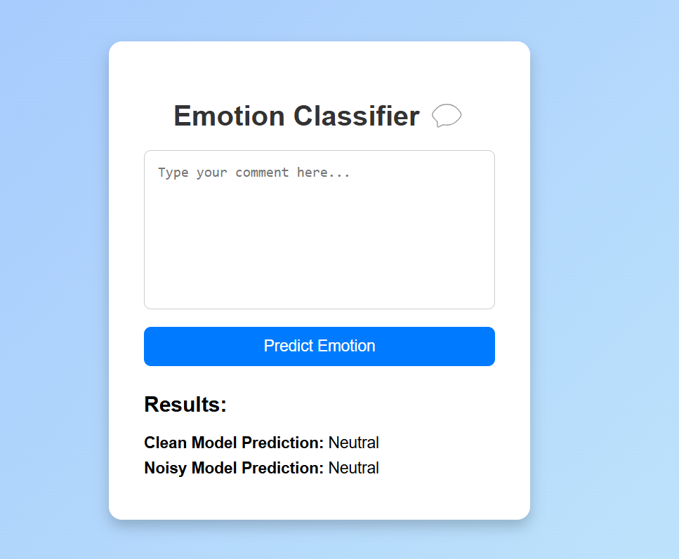

# Sentiment Analysis ML Project

## Overview

This project focuses on building a sentiment analysis model to classify emotions from text input. The project includes preprocessing, training multiple machine learning models, and deploying a web application using Flask.

## Project Structure

```
sentiment-analysis/
│
├── assets/
│   └── plots/
├── data/
│   ├── processed/
│   │   ├── noisy_data.csv
│   │   └── notnoisy_data.csv
│   └── raw/
├── env/
│   └── (virtual environment files)
├── models/
├── plots/
|── reports/
│       ├── 03_inject_noisy.ipynb
│       ├── 04_model_training_noisy.ipynb
│       ├── 05_retraining_models.py
│       └── eda_report.txt
├── src/
│   ├── models/
│   └── reports/
│       ├── 01_preprocess.ipynb
│       ├── 02_model_building_evaluation.ipynb
│       └── model_building.log
├── web_app/
│   ├── static/
│   ├── templates/
│   └── app.py
├── LICENSE
├── .gitignore
└── README.md
```

## Data

- **Raw Data**: Stored in `data/raw/`.
- **Processed Data**: Stored in `data/processed/`. Includes `noisy_data.csv` and `notnoisy_data.csv` for comparison.

## Preprocessing and Training

- Preprocessing is handled in `src/reports/01_preprocess.ipynb`.
- Model building and evaluation are documented in `src/reports/02_model_building_evaluation.ipynb`.
- Noisy data injection is implemented in `plots/reports/03_inject_noisy.ipynb`.
- Training with noisy data is covered in `plots/reports/04_model_training_noisy.ipynb`.
- Retraining models is scripted in `plots/reports/05_retraining_models.py`.
- Models trained include:
  - Logistic Regression
  - Random Forest
  - Gradient Boosting
  - SVM
  - XGBoost
- The best model was selected and successfully saved in the `models/` directory.
- Exploratory data analysis report is available in `plots/reports/eda_report.txt`.
- Training logs are stored in `src/reports/model_building.log`.

## Web Application

- The web application is built using Flask and is located in `web_app/app.py`.
- It runs locally at `http://127.0.0.1:5000/`.
- The app includes a user interface with templates in `web_app/templates/` and static files in `web_app/static/`.
- The app predicts emotions using both clean and noisy models, displaying results like "Clean Model Prediction: Neutral" and "Noisy Model Prediction: Neutral".

## Setup

1. Create a virtual environment in the `env/` directory.
2. Install required dependencies.
3. Navigate to `web_app/` and run `app.py` to start the Flask server.

## License

This project is licensed under the terms of the [MIT License](LICENSE).


## Gitignore

- Virtual environment files
- Python compiled files
- Model files
- Data files


## 📈 Analysis

# 🔍 Feature Correlation

Below is the correlation heatmap showing relationships among features:


## 🌐 Deployed Project Screenshots

### 🏠 Home Page


### 📊 Result

